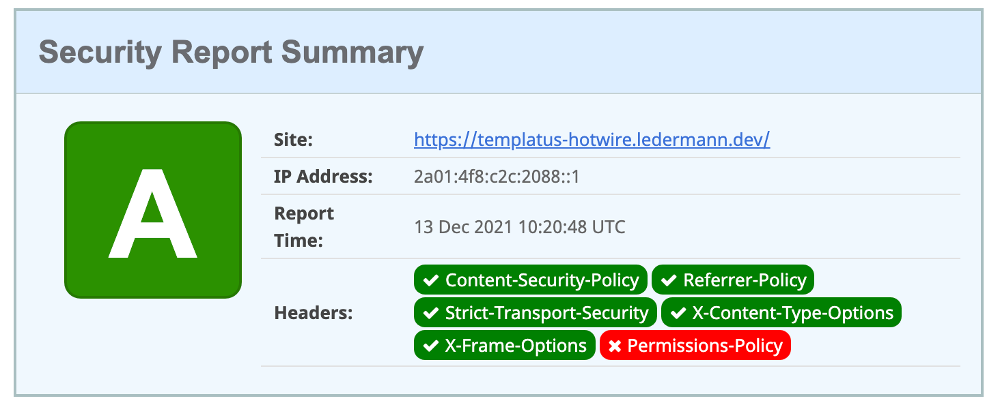
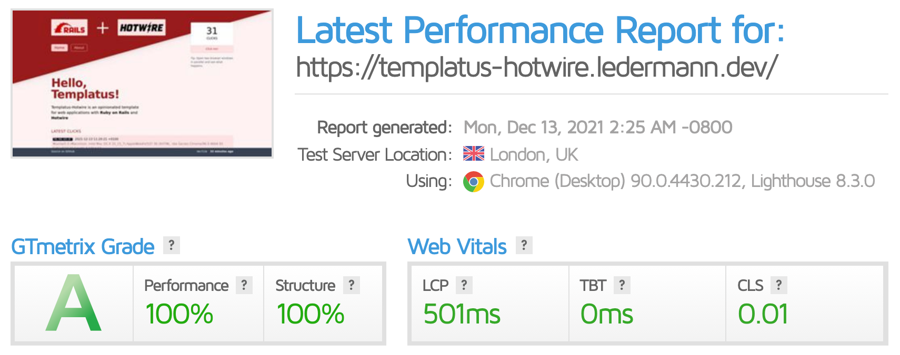

[](https://github.com/ledermann/templatus-hotwire/actions)
[](https://dashboard.cypress.io/projects/5d6bqs/runs)
[](https://deepsource.io/gh/ledermann/templatus-hotwire/?ref=repository-badge)

# Templatus-Hotwire

Templatus-Hotwire is an opinionated template to build web applications with Ruby on Rails and Hotwire. It simplifies the process of setting up a new application while following best practices.

Live demo available at https://templatus-hotwire.ledermann.dev

## Features / Technology stack

### Backend

- [Ruby](https://www.ruby-lang.org/de/) 3
- [Ruby on Rails](https://rubyonrails.org/) 7.0
- [ActionCable](https://guides.rubyonrails.org/action_cable_overview.html) for WebSocket communication
- [PostgreSQL](https://www.postgresql.org/) for using as SQL database
- [Sidekiq](https://sidekiq.org/) for background processing
- [Redis](https://redis.io/) for Caching, ActionCable, and Sidekiq

### Frontend

- [Hotwire](https://hotwire.io/) for building the frontend without using much JavaScript by sending HTML instead of JSON over the wire
- [ViewComponent](https://viewcomponent.org/) for creating reusable, testable & encapsulated view components
- [Slim](http://slim-lang.com/) for writing templates instead of ERB
- [Tailwind CSS 3](https://tailwindcss.com/) to not have to write CSS at all
- [Heroicons](https://heroicons.com/) for beautiful hand-crafted SVG icons
- [Rails Request.JS](https://github.com/rails/request.js) for AJAX requests with default headers
- [esbuild](https://esbuild.github.io/) for bundling JavaScript

### Development

- [Puma-dev](https://github.com/puma/puma-dev) for using .test-domain and HTTPS in development
- [Foreman](https://github.com/ddollar/foreman) for starting up the application locally
- [dotenv](https://github.com/bkeepers/dotenv) to load environment variables from .env into ENV
- [Prettier](https://prettier.io/) for auto-formatting JavaScript and Ruby code in Visual Studio Code
- Live reloading

### Linting and testing

- [RuboCop](https://rubocop.org/) for Ruby static code analysis
- [ESLint](https://eslint.org/) for JavaScript static code analysis
- [RSpec](https://rspec.info/) for Ruby testing
- [Cypress](https://www.cypress.io/) for E2E testing

### Deployment

- [Docker](https://www.docker.com/) for production deployment, NOT for development
- [DockerRailsBase](https://github.com/ledermann/docker-rails-base) for fast building an optimized Docker image based on Alpine Linux
- [GitHub Actions](https://docs.github.com/en/actions) for testing, linting, and building Docker image
- [Dependabot](https://docs.github.com/en/code-security/supply-chain-security/keeping-your-dependencies-updated-automatically/about-dependabot-version-updates) configuration for updating dependencies (with auto-merge)
- Ready for serving assets via CDN like CloudFront
- [Honeybadger](https://www.honeybadger.io/) for error tracking in Ruby and JavaScript

### Production

- [Lograge](https://github.com/roidrage/lograge) for single-line logging
- Gzip and Brotli compression of all dynamic responses (HTML, JSON) using [Rack::Deflater](https://github.com/rack/rack/blob/master/lib/rack/deflater.rb) and [Rack::Brotli](https://github.com/marcotc/rack-brotli)
- Fine-tuned Content Security Policy (CSP)
- Ready for PWA (manifest, service-worker)

## Metrics

This template is developed with optimized performance and security in mind. The following benchmarks are
performed against the demo installation on production. It uses an inexpensive virtual server on the [Hetzner Cloud](https://www.hetzner.com/de/cloud) behind a [Traefik](https://traefik.io/traefik/) setup.

### Lighthouse site performance

100% in all categories.


### Secure headers

[](https://securityheaders.com/?q=templatus-hotwire.ledermann.dev&followRedirects=on)

What's the red _Permissions-Policy_ badge? This seems to be fixed with one of the next Rails update:
https://github.com/rails/rails/pull/41994

### Mozilla Observatory

[](https://observatory.mozilla.org/analyze/templatus-hotwire.ledermann.dev)

### WebPageTest

[](https://webpagetest.org/result/211213_AiDcS0_a690602e1bbcc6121d478fbd94f323b2/)

### GTmetrix

[](https://gtmetrix.com/reports/templatus-hotwire.ledermann.dev/HPh4sFDK/)

### Check-your-website

[](https://check-your-website.server-daten.de/?q=templatus-hotwire.ledermann.dev)

### JavaScript size

136 KB of compiled JavaScript (minified, uncompressed). The largest parts are:

- Honeybadger (22 KB)
- ActionCable (10 KB)

```
RAILS_ENV=production SECRET_KEY_BASE=temp bin/rails assets:clobber assets:precompile
```

### Network transfer

Small footprint: The demo application transfers only **54 KB** of data on the first visit.


### Docker build time

With multi-stage building and using [DockerRailsBase](https://github.com/ledermann/docker-rails-base) the build of the Docker image takes very little time. Currently, the build job requires about 1,5 minutes on GitHub Actions (see https://github.com/ledermann/templatus-hotwire/actions)

### Docker image size

The Docker image is based on Alpine Linux and is optimized for minimal size (currently **117 MB** uncompressed disk size). It includes just the bare minimum - no build tools like Node.js, no JS sources (just the compiled assets), no tests.

```
$ container-diff analyze ghcr.io/ledermann/templatus-hotwire -n

-----Size-----

Analysis for ghcr.io/ledermann/templatus-hotwire:
IMAGE                                      DIGEST       SIZE
ghcr.io/ledermann/templatus-hotwire        sha256:...   117.3M
```

## Getting startet

### Install for development

1. Clone the repo locally:

```bash
git clone git@github.com:ledermann/templatus-hotwire.git
cd templatus-hotwire
```

2. Install PostgreSQL, Redis, and puma-dev (if not already present). On a Mac with HomeBrew, run this to install from the `Brewfile`:

```bash
brew bundle
```

3. Install and set up [puma-dev](https://github.com/puma/puma-dev) to use HTTPS. Do this on macOS:

```bash
sudo puma-dev -setup
puma-dev -install
puma-dev link
```

4. Setup the application to install gems and NPM packages and create the database:

```bash
bin/setup
```

5. Start the application locally:

```bash
bin/dev
```

Then open https://templatus-hotwire.test in your browser.

### Run linters

RuboCop:

```
bin/rubocop
```

ESLint:

```
bin/yarn lint
```

### Run tests locally

Ruby tests:

```
bin/rspec
open coverage/index.html
```

JavaScript unit tests:

```
bin/yarn test
```

E2E tests with Cypress:

```
bin/cypress open
```

This opens Cypress and starts Rails in `development` environment, but with `CYPRESS=true`, so the `test` database is used. This allows code editing without class reloading and recompiling assets.

To run Cypress in headless mode:

```
bin/cypress run
```

### Deploy locally

```
docker network create public
docker-compose up
```
